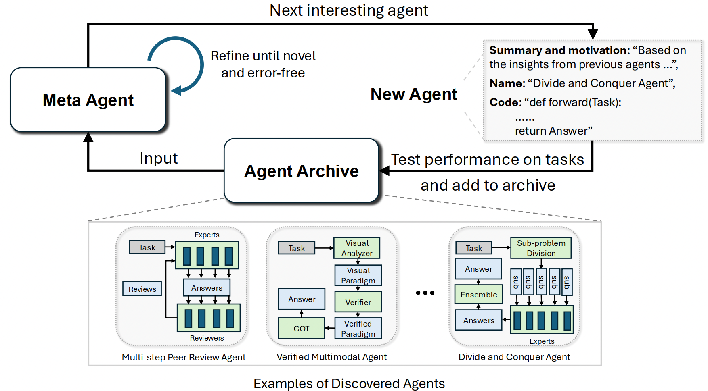

# Automated Design of Agentic Systems

- PDF: https://openreview.net/pdf?id=t9U3LW7JVX
- Code: https://github.com/ShengranHu/ADAS

## Summary

This paper studies how to automatically design AI agents through a framework called **Automated Design of Agentic Systems (ADAS)**, where each agent is represented as executable code (including prompts, reasoning steps, tool usage, and control flow). Instead of manually crafting these pipelines, a language model is used to generate different agent designs, where each design corresponds to a specific way of solving a task (e.g., direct answering, multi-step reasoning, self-refinement). This shifts the focus from optimizing prompts to exploring a broader space of structured agent behaviors.

The approach uses an iterative search process (Meta Agent Search) that generates candidate agents, evaluates them on tasks, and retains the better-performing ones to guide future designs. Over multiple iterations, this process discovers increasingly effective agent structures without any model training. The key idea is that repeatedly generating and testing agent code using an LLM can uncover non-trivial strategies that perform well and generalize across tasks.

## Additional context (meta-agent vs meta-learning)

**Meta-agent:** an agent that designs or improves other agents.  
Example: given a QA task, instead of answering questions itself, it generates different agent programs (e.g., one that uses retrieval + reasoning, another that uses self-reflection), runs them, compares their performance, and keeps the best design.

**Meta-learning:** learning how to learn across tasks, usually at the model level.  
Example: training a model so it can quickly adapt to a new classification task with only a few examples.

**Are they the same?** No, they are distinct. A meta-agent operates at the **system/design level** (building and selecting agent workflows), while meta-learning operates at the **model/training level** (improving how a model learns from data).
