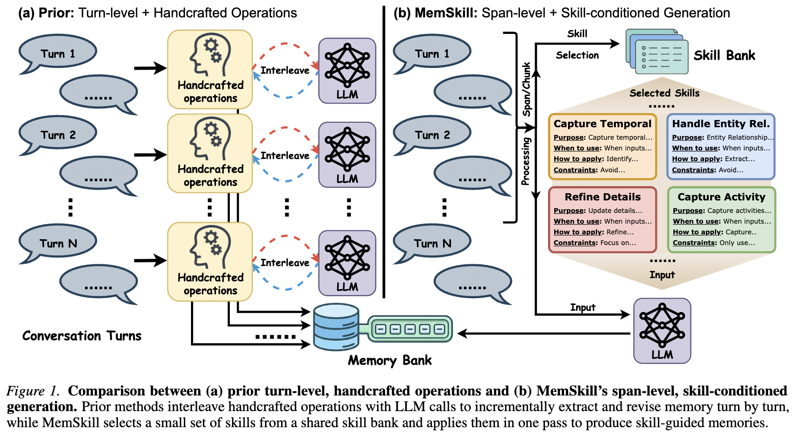
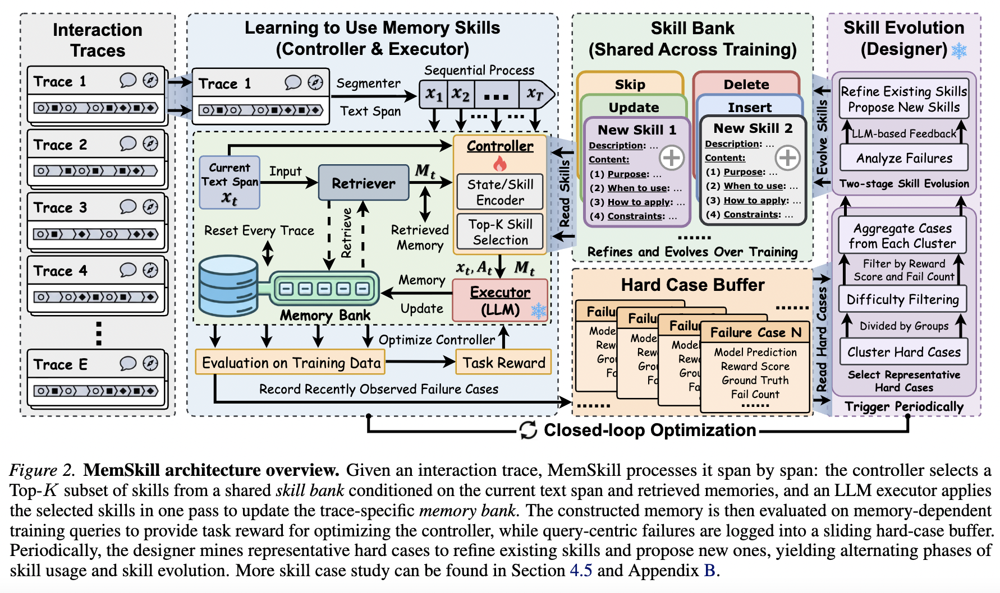

# MemSkill: Learning and Evolving Memory Skills for Self-Evolving Agents

- PDF: https://arxiv.org/pdf/2602.02474
- Code: https://github.com/ViktorAxelsen/MemSkill

## Summary

**Main Idea**

LLM agent memory systems typically rely on a small set of static, hand-designed operations (such as add, update, delete, and skip) for extracting, consolidating, and revising memory. These fixed procedures are inefficient on long histories and rigid under diverse interaction patterns.

**MemSkill** makes these memory operations **learnable and evolvable** by reframing them as an **evolving skill bank** — reusable skills that are continuously refined over training based on hard cases and failures. The result is a **self-evolving agent memory system** driven by interaction data.

**Controller**

The controller is the decision-making component that selects which skill to apply at each step. It is implemented as a lightweight multilayer perceptron (MLP) that takes as input a state embedding derived from the current context and retrieved memory using a shared embedding model (e.g., Qwen3-Embedding-0.6B). The controller is the only trainable part of the system and is optimized using reinforcement learning, where rewards are computed based on task-level performance such as answer correctness. The training objective encourages the controller to favor sequences of skill selections that lead to better final outcomes.

**Executor**

The executor is responsible for executing the selected skill and generating outputs. It is implemented as a frozen large language model accessed via API, specifically LLaMA3.3-70B-Instruct during training and Qwen3-Next80B-A3B-Instruct for transfer experiments. Given the selected skill and the current context, the executor produces outputs such as reasoning steps, retrieved information, or final answers. The executor is not trained and serves as a fixed environment in the system.

**Designer**

The designer is responsible for generating and refining the set of available skills. It is implemented using an LLM-based prompting strategy that analyzes trajectories and failures to propose new or improved skills. The designer is fixed and not trained; it does not undergo optimization and instead relies on predefined prompting mechanisms to expand the skill set over time.

**Closed-Loop Optimization**

MemSkill operates in a closed-loop cycle where the controller selects skills, the executor applies them to generate outputs, and the system evaluates the results to compute rewards. These rewards are used to update the controller through reinforcement learning, while the designer can introduce new skills based on observed failures. This iterative loop enables continuous improvement in both skill selection and the overall system performance.
